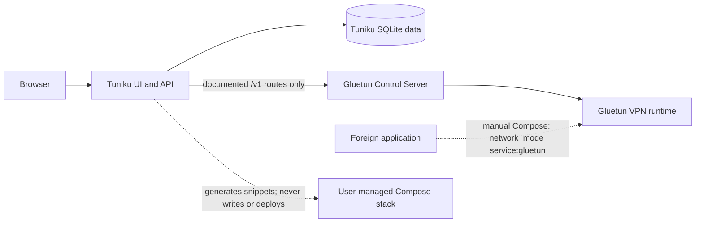

# Tuniku

<p align="center">
  
</p>

**Gluetun Web Interface** — a secure, self-hosted dashboard for supported Gluetun
Control Server functions and a generation-only Docker Compose assistant.

## Overview

Tuniku observes one Gluetun instance, exposes only an explicit allow-list of
documented control actions, and generates validated guidance for manual Docker
Compose changes. The data model and API use an instance identifier so a future
multi-instance version does not require a destructive migration.

Tuniku runs separately from Gluetun. Gluetun also runs separately from
qBittorrent and every other application. Other applications may be placed
behind Gluetun manually through Docker Compose, but Tuniku never changes their
networking.

## Part of the Ishiku family

Tuniku follows the shared **Pixel Soft Utility** design system used by Ishiku
applications: a calm, rounded, self-hosted utility interface with consistent
first-run setup, mobile and desktop navigation, and six shared themes. Each
theme supports System, Light, and Dark mode.

## Features

- Responsive overview for VPN, public IP, DNS, updater, and port-forwarding state.
- Capability detection against the connected Gluetun version.
- Allow-listed VPN start/stop, DNS start/stop, updater start, and supported
  port-forwarding changes.
- Local administrator account with first-run registration, Argon2id password
  hashing, server-side sessions, CSRF protection, and rate limits.
- Gluetun API key, Basic Auth, or deliberately unauthenticated local operation.
- Optional encrypted credential persistence; credentials otherwise remain
  ephemeral in server memory.
- Compose Assistant with defensive YAML inspection, validation, secret
  redaction, port-collision checks, downloads, and manual deployment steps.
- Local port labels that never imply an integration with a foreign application.
- English interface copy throughout the application.
- Lavender, Mint, Sky, Amber, Rose, and Graphite themes.
- Health and readiness endpoints for container platforms.

### What Tuniku is

- A Gluetun Control Server dashboard.
- A small allow-listed Gluetun controller.
- A Compose, `.env`, and secret-guidance generator.
- A local port overview and setup helper.

### What Tuniku is not

- A Portainer replacement or general Docker administrator.
- A qBittorrent, Sonarr, Radarr, Prowlarr, or media-stack manager.
- An automatic Compose editor, stack deployer, or container restarter.
- A routing autopilot for foreign containers.

Tuniku generates instructions and snippets but does not write Compose files
automatically. It does not modify, restart, recreate, or manage foreign
containers.

## Tech stack

- React 19 and TypeScript for the responsive web interface.
- Fastify 5 and TypeScript for the internal REST API.
- SQLite through `better-sqlite3`.
- Argon2id for administrator password hashing.
- YAML parsing and rendering through `yaml`.
- Docker-first production deployment on Node.js 24 LTS.
- Vitest integration and unit tests, plus Playwright-ready end-to-end setup.

## Architecture



Tuniku's Gluetun adapter uses only the routes documented in the official
[Gluetun Control Server guide](https://github.com/qdm12/gluetun-wiki/blob/main/setup/advanced/control-server.md).
Unknown endpoints or response schemas are reported as unsupported instead of
being treated as successful.

More detail is available in [docs/architecture.md](docs/architecture.md).

## Installation

### Docker Compose

The primary `docker-compose.yml` is ready for ZimaOS and follows the same
first-run pattern as the other ishiku account apps. Before deployment, edit
the Compose file and:

- set `ISHIKU_SETUP_SECRET` to at least 32 random characters;
- set the Gluetun provider, VPN type, and Control Server role values;
- confirm the host paths under `/DATA/AppData/i_tuniku/`.

Tuniku runs as UID/GID `1000`. If the host creates the data directory with
different ownership, run
`chown -R 1000:1000 /DATA/AppData/i_tuniku/Data` before deployment.

Generate a suitable one-time setup value with:

```sh
openssl rand -base64 48
```

Tuniku creates its internal session and credential-encryption keys
automatically under `/data/.secrets`; they do not need separate Compose
fields. Do not commit a populated Compose file.

Configure Gluetun using the current
[official Gluetun setup documentation](https://github.com/qdm12/gluetun-wiki/tree/main/setup),
then start the stack:

```sh
docker compose up -d
```

Open `http://<docker-host>:65001` or route Tuniku through your own reverse
proxy.

For a file-backed setup secret, use `docker-compose.example.yml`. That
hardened alternative mounts only `secrets/setup_secret.txt`; the two internal
keys remain managed by Tuniku.

The example does not publish Gluetun's port `8000` to the host. Tuniku reaches
it through the Compose network at `http://gluetun:8000`.

### First start

When the database contains no administrator, Tuniku blocks normal application
access and opens the first-run registration window. If `ISHIKU_SETUP_SECRET`
is missing or shorter than 32 characters, setup fails closed and identifies
the missing configuration key without revealing the value.

### Create the administrator account

Enter the `ISHIKU_SETUP_SECRET` value, then choose a display name, username,
and a password of at least 12 characters. The administrator password must
differ from the setup secret. Public registration closes
immediately after the first administrator is created.

## Configuration

### Environment variables

| Variable | Default | Purpose |
|---|---:|---|
| `TUNIKU_PORT` | `8080` | HTTP listen port inside the container |
| `TUNIKU_DATA_PATH` | `/data` | Persistent data directory |
| `TUNIKU_LOG_LEVEL` | `info` | `debug`, `info`, `warn`, or `error` |
| `TUNIKU_TRUSTED_PROXY_COUNT` | `0` | Trusted reverse-proxy hop count |
| `TUNIKU_SECURE_COOKIES` | `false` | Set `true` when served through HTTPS |
| `ISHIKU_SETUP_SECRET` | unset | Required one-time first-admin setup value; minimum 32 characters |
| `ISHIKU_SETUP_SECRET_FILE` | `/run/secrets/ishiku_setup_secret` | Optional file-backed setup value |
| `TUNIKU_ALLOW_LOOPBACK_UPSTREAM` | `false` | Advanced explicit loopback Control Server access |
| `TUNIKU_DOCKER_PROXY_URL` | unset | Optional restricted HTTP Docker Socket Proxy for read-only Gluetun observation |

Legacy `TUNIKU_REGISTRATION_SECRET(_FILE)`, `TUNIKU_SESSION_SECRET(_FILE)`,
and `TUNIKU_ENCRYPTION_KEY(_FILE)` settings remain supported for existing
deployments. New deployments should not configure separate session or
encryption secrets.

### Docker Secrets

The setup secret is only for first-run registration. Tuniku reads a file-backed
setup value before its environment fallback and never logs secret values or
lengths. On first start it atomically creates a cookie-signing secret and a
credential-encryption key with mode `0600` under `/data/.secrets`. The latter
protects Gluetun credentials only when an administrator explicitly enables
encrypted persistence.

Sensitive values may be entered locally for snippet generation. By default
they exist only for that request and are neither written to drafts nor browser
`localStorage`. Full-secret output requires an explicit checkbox and should be
treated as sensitive.

Secrets must not be committed to public repositories.

### Persistent data

The `/data` mount contains:

- `tuniku.db` — administrators, sessions, instance preferences, local port
  labels, redacted drafts, and redacted audit metadata.
- SQLite WAL files while the service is running.
- `.secrets/` — automatically generated internal session and credential keys.

No VPN credentials are stored unless encrypted persistence is explicitly
enabled and an encryption key is configured.

### Optional Docker observation

Set `TUNIKU_DOCKER_PROXY_URL` only to a restricted Docker Socket Proxy that
permits container-list and container-inspect `GET` requests. Tuniku can then
read Gluetun health, published ports, networks, and environment variable names.
Sensitive environment values are never returned. The integration is disabled
by default and has no write methods. Do not mount the raw Docker socket.

### Connect to Gluetun Control Server

Open **Settings → Gluetun connection** and configure:

- Display name.
- Base URL, normally `http://gluetun:8000` in the example stack.
- Authentication mode: API key, Basic Auth, or intentionally none.
- TLS verification and request timeout.
- Optional encrypted credential storage.

Current Gluetun releases keep routes private by default. Configure roles with
`HTTP_CONTROL_SERVER_AUTH_DEFAULT_ROLE` or
`/gluetun/auth/config.toml` as described in the
[official authentication guide](https://github.com/qdm12/gluetun-wiki/blob/main/setup/advanced/control-server.md#authentication).
API keys use the `X-API-Key` header.

## Compose Assistant

The assistant supports new setup, Control Server, authentication, provider and
VPN type, WireGuard, OpenVPN, server selection, published ports, manual
application routing, secret migration, and review tasks.

Every result contains:

1. Detected configuration.
2. Recommended change.
3. Copy-paste snippet.
4. Manual steps.
5. Security warnings.

Generated YAML is parsed before it is presented as valid. Pasted YAML is
treated as untrusted data and is never executed. Unknown existing Compose keys
are not silently discarded: Tuniku generates a separate proposal instead.

See [docs/compose-assistant.md](docs/compose-assistant.md).

### Route an application behind Gluetun manually

The basic relationship is:

```yaml
services:
  gluetun:
    ports:
      - "8080:8080/tcp" # Local descriptive label only

  app:
    image: example/app:version
    network_mode: "service:gluetun"
```

The application uses Gluetun's network namespace and no longer has its own
normal Compose network connection. Publish its web ports on the **Gluetun**
service, remove conflicting mappings from the application service, then
redeploy manually. Tuniku does not inspect, authenticate to, configure, or
restart the application.

The official Gluetun documentation distinguishes
[VPN provider port forwarding](https://github.com/qdm12/gluetun-wiki/blob/main/setup/advanced/vpn-port-forwarding.md)
from Docker port publishing. Tuniku presents them separately.

### ZimaOS

Import `docker-compose.yml` in the ZimaOS interface, fill the single
`ISHIKU_SETUP_SECRET` field and the required Gluetun values, save the stack,
and deploy it. UI terminology can vary by ZimaOS version. Tuniku never presses
deploy or recreates containers.

See [docs/zimaos.md](docs/zimaos.md).

## Security

- Argon2id password hashes; no plaintext administrator passwords.
- HttpOnly, SameSite=Lax, signed session cookie with server-side session state.
- CSRF protection for state-changing operations.
- Strict rate limits for setup, login, connection tests, Compose generation,
  and Gluetun control.
- Restrictive Content Security Policy and standard browser security headers.
- SSRF validation for configured upstream URLs, with metadata and link-local
  destinations blocked.
- Explicit Gluetun route and mutation allow-list.
- Credential and configuration redaction in audit data, logs, diagnostics, and
  stored drafts.
- No shell execution, writable Docker socket, or host Compose write path.

Use HTTPS through a trusted reverse proxy outside a trusted local network and
set `TUNIKU_SECURE_COOKIES=true`. Read [docs/security.md](docs/security.md) and
[SECURITY.md](SECURITY.md) before exposing the service.

## Updates and backup

Stop Tuniku or create a consistent SQLite backup, then copy
`/DATA/AppData/i_tuniku/Data`. This preserves the database and both internal
keys. Back up `/DATA/AppData/i_tuniku/Gluetun` separately.

Update with:

```sh
docker compose pull
docker compose up -d
```

For a local build:

```sh
git pull --ff-only
docker compose -f docker-compose.example.yml up -d --build
```

Restore by stopping Tuniku, restoring the complete `/data` contents, and
starting the service again. Existing installations that provide an external
encryption key must keep that key with the backup while encrypted Gluetun
credentials remain stored.

## Troubleshooting

- **Tuniku needs configuration:** set `ISHIKU_SETUP_SECRET` to at least 32
  characters or mount `ISHIKU_SETUP_SECRET_FILE`.
- **Control Server unreachable:** confirm the URL from inside Tuniku's Docker
  network. `localhost` means the Tuniku container itself.
- **Unauthorized:** verify the Gluetun role, authentication mode, and route
  permissions.
- **Unsupported capability:** the connected Gluetun release or role does not
  expose that route. Tuniku does not simulate success.
- **TLS verification failed:** install or trust the correct certificate before
  considering the advanced verification switch.
- **Stale state:** the last successful data remains visible but is marked
  stale. Check the current Control Server state before repeating an action.

## Development

Requirements: Node.js 24 and npm.

```sh
npm install
npm run dev
```

The Vite development server runs on port `5173` and proxies the API to the
Fastify server on port `8080`.

Run the complete local verification:

```sh
npm run check
```

Contributions must preserve the product boundaries, keep source and
documentation in English, and avoid adding undocumented Gluetun endpoints.
See [CONTRIBUTING.md](CONTRIBUTING.md).

## Created with ChatGPT Codex

Tuniku was designed and implemented with assistance from ChatGPT Codex. Codex
does not own or maintain the project.

## Status and license

Tuniku `0.3.0` preserves the product behavior while aligning first-run setup,
ZimaOS delivery, and runtime secret management with the ishiku platform.
Gluetun API availability remains
version- and role-dependent.

Licensed under the [MIT License](LICENSE).
