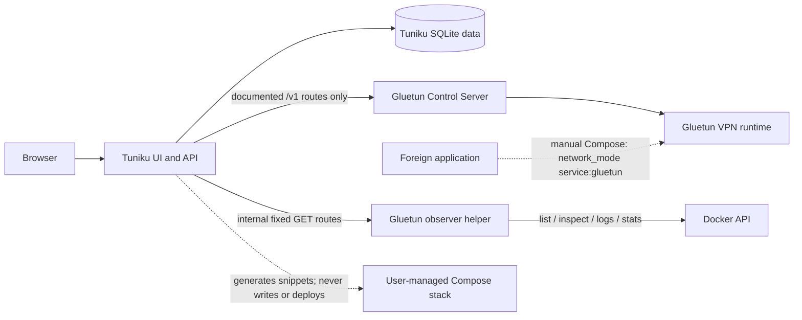

# Tuniku

<p align="center">
  
</p>

**Gluetun Web Interface** — a secure, self-hosted dashboard for supported Gluetun
Control Server functions and a generation-only Docker Compose assistant.

## Overview

Tuniku observes one Gluetun instance, exposes only an explicit allow-list of
documented control actions, and generates validated guidance for manual Docker
Compose changes. The data model and API use an instance identifier so a future
multi-instance version does not require a destructive migration.

Tuniku runs separately from Gluetun. Gluetun also runs separately from
qBittorrent and every other application. Other applications may be placed
behind Gluetun manually through Docker Compose, but Tuniku never changes their
networking.

## Part of the Ishiku family

Tuniku follows the shared **Pixel Soft Utility** design system used by Ishiku
applications: a calm, rounded, self-hosted utility interface with consistent
first-run setup, mobile and desktop navigation, and six shared themes. Each
theme supports System, Light, and Dark mode.

## Features

- Responsive overview for VPN, public IP and Gluetun-provided location, DNS,
  updater, Docker-published ports, VPN-provider port forwarding, and traffic.
- Capability detection against the connected Gluetun version.
- Allow-listed VPN start/stop, DNS start/stop, updater start, and supported
  port-forwarding changes.
- Local administrator account with first-run registration, Argon2id password
  hashing, idle and absolute session expiry, password-confirmed revocation,
  CSRF protection, and network/account rate limits.
- Gluetun API key, Basic Auth, or deliberately unauthenticated local operation.
- Optional encrypted credential persistence; credentials otherwise remain
  ephemeral in server memory.
- Compose Assistant with defensive YAML inspection, validation, secret
  redaction, port-collision checks, downloads, and manual deployment steps.
- Provider- and protocol-specific setup fields with searchable choices from
  the official Gluetun server catalog and an authenticated refresh action.
- Docker-level Gluetun state, health, exit, restart, timestamp, configuration,
  and bounded redacted log diagnostics that do not require a container shell.
- Aggregate Gluetun download/upload rates, daily totals, and a rolling 90-day
  total from Docker Stats, without packet or destination logging.
- Automatic display of ports published on the Gluetun container.
- Local port labels that never imply an integration with a foreign application.
- English interface copy throughout the application.
- Lavender, Mint, Sky, Amber, Rose, and Graphite themes.
- Health and readiness endpoints for container platforms.

### What Tuniku is

- A Gluetun Control Server dashboard.
- A small allow-listed Gluetun controller.
- A Compose, `.env`, and secret-guidance generator.
- A local port overview and setup helper.

### What Tuniku is not

- A Portainer replacement or general Docker administrator.
- A qBittorrent, Sonarr, Radarr, Prowlarr, or media-stack manager.
- An automatic Compose editor, stack deployer, or container restarter.
- A routing autopilot for foreign containers.

Tuniku generates instructions and snippets but does not write Compose files
automatically. It does not modify, restart, recreate, or manage foreign
containers.

## Tech stack

- React 19 and TypeScript for the responsive web interface.
- Fastify 5 and TypeScript for the internal REST API.
- SQLite through `better-sqlite3`.
- Argon2id for administrator password hashing.
- YAML parsing and rendering through `yaml`.
- Docker-first production deployment on Node.js 24 LTS.
- Vitest integration and unit tests, plus Playwright-ready end-to-end setup.

## Architecture



Tuniku's Gluetun adapter uses only the routes documented in the official
[Gluetun Control Server guide](https://github.com/qdm12/gluetun-wiki/blob/main/setup/advanced/control-server.md).
Unknown endpoints or response schemas are reported as unsupported instead of
being treated as successful.

More detail is available in [docs/architecture.md](docs/architecture.md).

## Installation

### Docker Compose

The primary `docker-compose.yml` is ready for ZimaOS and follows the same
first-run pattern as the other ishiku account apps. Before deployment, edit
the Compose file and:

- set `ISHIKU_SETUP_SECRET` to at least 32 random characters;
- confirm the Tuniku host path under `/DATA/AppData/i_tuniku/Data`.

No Gluetun provider or VPN credential is required before this first start.
The primary stack contains the Tuniku application plus an isolated diagnostic
helper, but no Gluetun service. This prevents an invalid VPN configuration from
blocking the setup interface or creating a Gluetun restart loop. The helper is
optional for custom deployments; it only supplies Docker-level Gluetun status
and logs, published ports, and aggregate traffic counters.

Tuniku runs as UID/GID `1000`. If the host creates the data directory with
different ownership, run
`chown -R 1000:1000 /DATA/AppData/i_tuniku/Data` before deployment.

Generate a suitable one-time setup value with:

```sh
openssl rand -base64 48
```

Tuniku creates its internal session and credential-encryption keys
automatically under `/data/.secrets`; they do not need separate Compose
fields. Do not commit a populated Compose file.

Start Tuniku:

```sh
docker compose up -d
```

Open `http://<docker-host>:65001` or route Tuniku through your own reverse
proxy.

Create the administrator, then choose **Create Gluetun configuration**. Enter
the provider from the Gluetun dropdown, then follow the protocol-specific
credential, server selection, and Control Server authentication steps. The
download is a separate Gluetun-only add-on stack. Keep the current Tuniku stack
running and import the add-on in ZimaOS. It joins the existing external Docker
network named `tuniku`, so it neither duplicates Tuniku nor collides with host
port `65001`. After Gluetun is healthy, connect Tuniku to
`http://gluetun:8000` with the same Control Server authentication values.

The Compose includes direct values and does not require an env file. An
optional env download is available for operators who prefer that format.

This manual deployment step is intentional. Provider settings are Gluetun
container startup settings; the Tuniku application does not mount the Docker
socket, write host Compose files, or recreate containers. In the primary
Compose, only the separate internal observer helper sees the socket and its
HTTP surface is limited to fixed Gluetun list, inspect, logs, and aggregate
stats operations.

For a file-backed setup secret and a Gluetun configuration prepared before
startup, use `docker-compose.example.yml`. That hardened alternative mounts
only `secrets/setup_secret.txt`; the two internal keys remain managed by
Tuniku. Tuniku still has no startup dependency on Gluetun.

The example does not publish Gluetun's port `8000` to the host. Tuniku reaches
it through the Compose network at `http://gluetun:8000`.

### First start

When the database contains no administrator, Tuniku blocks normal application
access and opens the first-run registration window. If `ISHIKU_SETUP_SECRET`
is missing or shorter than 32 characters, setup fails closed and identifies
the missing configuration key without revealing the value.

After registration, a deployment without an existing Gluetun connection opens
a choice between generating a new Gluetun configuration and connecting an
already running Control Server.

### Create the administrator account

Enter the `ISHIKU_SETUP_SECRET` value, then choose a display name, username,
and a password of at least 12 characters. The administrator password must
differ from the setup secret. Public registration closes
immediately after the first administrator is created.

## Configuration

### Environment variables

| Variable | Default | Purpose |
|---|---:|---|
| `TUNIKU_PORT` | `8080` | HTTP listen port inside the container |
| `TUNIKU_DATA_PATH` | `/data` | Persistent data directory |
| `TUNIKU_LOG_LEVEL` | `info` | `debug`, `info`, `warn`, or `error` |
| `TUNIKU_TRUSTED_PROXY_COUNT` | `0` | Trusted reverse-proxy hop count |
| `HTTPS_ONLY` | `false` | Set `true` only behind an HTTPS reverse proxy; makes the session cookie Secure. `HTTPSONLY` and legacy `TUNIKU_SECURE_COOKIES` remain accepted aliases. |
| `ISHIKU_SETUP_SECRET` | unset | Required one-time first-admin setup value; minimum 32 characters |
| `ISHIKU_SETUP_SECRET_FILE` | `/run/secrets/ishiku_setup_secret` | Optional file-backed setup value |
| `TUNIKU_ALLOW_LOOPBACK_UPSTREAM` | `false` | Advanced explicit loopback Control Server access |
| `TUNIKU_DOCKER_PROXY_URL` | unset | Optional restricted HTTP Docker Socket Proxy for read-only Gluetun observation |

Legacy `TUNIKU_REGISTRATION_SECRET(_FILE)`, `TUNIKU_SESSION_SECRET(_FILE)`,
and `TUNIKU_ENCRYPTION_KEY(_FILE)` settings remain supported for existing
deployments. New deployments should not configure separate session or
encryption secrets.

### Docker Secrets

The setup secret is only for first-run registration. Tuniku reads a file-backed
setup value before its environment fallback and never logs secret values or
lengths. On first start it atomically creates a cookie-signing secret and a
credential-encryption key with mode `0600` under `/data/.secrets`. The latter
protects Gluetun credentials only when an administrator explicitly enables
encrypted persistence.

Sensitive values may be entered locally for snippet generation. By default
they exist only for that request and are neither written to drafts nor browser
`localStorage`. Full-secret output requires an explicit checkbox and should be
treated as sensitive.

Secrets must not be committed to public repositories.

### Persistent data

The `/data` mount contains:

- `tuniku.db` — administrators, sessions, instance preferences, local port
  labels, rolling aggregate traffic totals, redacted drafts, and redacted audit
  metadata.
- SQLite WAL files while the service is running.
- `.secrets/` — automatically generated internal session and credential keys.

No VPN credentials are stored unless encrypted persistence is explicitly
enabled and an encryption key is configured.

### Gluetun diagnostics

The primary Compose includes `tuniku-docker-observer` on an internal network.
It reads only the Gluetun container list, inspect metadata, the final 200 log
lines, and one-shot Docker Stats for the selected Gluetun container. It
publishes no host port, strips environment values before returning metadata,
and implements no Docker write, exec, archive, image, volume, or network route.
Tuniku remains independent if the helper or Gluetun is absent.

The Overview labels VPN-provider port forwarding separately from host ports
published by Docker. Runtime bindings come from `NetworkSettings.Ports`; when a
container is stopped, Tuniku also checks its configured `HostConfig.PortBindings`.
Detection refreshes with the Overview, so adding or recreating Gluetun does not
require a new Tuniku login.

Custom deployments may omit the helper and leave `TUNIKU_DOCKER_PROXY_URL`
unset, or point it at an equivalently restricted HTTP proxy. Never mount the
raw Docker socket into the Tuniku application. A read-only bind flag on a Unix
socket does not itself make Docker operations read-only; the helper's route
allow-list is the effective boundary.

### VPN traffic accounting

When the observer is available, the Overview shows the current aggregate
download/upload rates, today's transferred bytes, and a rolling 90-day total.
Tuniku samples Docker's cumulative Gluetun network counters every 10 seconds
and persists only positive byte deltas by local day. Container replacements and
counter resets start a new baseline instead of adding a false spike.

The values cover the whole Gluetun network namespace: Gluetun itself and every
application routed through it are combined, with small VPN, DNS, and control
overhead. Docker cannot reliably separate these applications once they share
that namespace. Tuniku does not capture packets and does not store destinations,
URLs, DNS queries, protocols, or payloads. Omit the optional observer if even
aggregate traffic retention is not wanted.

If sampling fails, the Overview shows whether the helper is missing, Gluetun is
stopped, Docker rejected the stats request, or network counters were absent.
Older Docker daemons that reject the `one-shot` option are retried with the
compatible single-response `stream=false` request.

### Public IP location

Current Gluetun releases can return country, region, and city alongside
`public_ip`. Tuniku displays those optional fields and remains compatible with
older IP-only responses. It does not call a second IP-geolocation service, so
showing the location creates no additional disclosure of the VPN address.

### Connect to Gluetun Control Server

Open **Settings → Gluetun connection** and configure:

- Display name.
- Base URL, normally `http://gluetun:8000` in the example stack.
- Authentication mode: API key, Basic Auth, or intentionally none.
- TLS verification and request timeout.
- Optional encrypted credential storage.

Current Gluetun releases keep routes private by default. Configure roles with
`HTTP_CONTROL_SERVER_AUTH_DEFAULT_ROLE` or
`/gluetun/auth/config.toml` as described in the
[official authentication guide](https://github.com/qdm12/gluetun-wiki/blob/main/setup/advanced/control-server.md#authentication).
API keys use the `X-API-Key` header.

## Compose Assistant

The assistant supports new setup, Control Server, authentication, provider and
VPN type, WireGuard, OpenVPN, server selection, published ports, manual
application routing, secret migration, and review tasks.

Provider choices and compatible protocols follow the current official
walkthroughs for `qmcgaw/gluetun:latest`. The form changes interactively to
request only the credentials, keys, certificates, filters, and provider options
documented for the selected combination. Search suggestions use a bundled
snapshot of the official `qdm12/gluetun-servers` data and can be refreshed in
the authenticated assistant without starting Gluetun. Generated output contains
`[REDACTED]` markers by default. Enable **Include secret values**
for one generation response, or replace every marker before deployment. Saved
drafts, audit events, logs, diagnostics, and Compose inspection always remain
redacted. Secret-bearing results are removed from the browser after 15 minutes.

Every result contains:

1. Detected configuration.
2. Recommended change.
3. Copy-paste snippet.
4. Manual steps.
5. Security warnings.

Generated YAML is parsed before it is presented as valid. Pasted YAML is
treated as untrusted data and is never executed. Unknown existing Compose keys
are not silently discarded: Tuniku generates a separate proposal instead.

See [docs/compose-assistant.md](docs/compose-assistant.md).

### Route an application behind Gluetun manually

If the application and Gluetun are services in the same Compose project, use:

```yaml
services:
  gluetun:
    ports:
      - "8080:8080/tcp" # Local descriptive label only

  app:
    image: example/app:version
    network_mode: "service:gluetun"
```

The application uses Gluetun's network namespace and no longer has its own
normal Compose network connection. Publish its web ports on the **Gluetun**
service, remove conflicting mappings from the application service, then
redeploy manually. Tuniku does not inspect, authenticate to, configure, or
restart the application.

If Gluetun is already running in a separate ZimaOS/Compose stack, use
`network_mode: "container:gluetun"` for the application instead. The
`service:gluetun` form only resolves within the same Compose project. In both
cases, publish the application's UI port on Gluetun, not on the application.

The official Gluetun documentation distinguishes
[VPN provider port forwarding](https://github.com/qdm12/gluetun-wiki/blob/main/setup/advanced/vpn-port-forwarding.md)
from Docker port publishing. Tuniku presents them separately.

### ZimaOS

Import `docker-compose.yml` in the ZimaOS interface, fill the single
`ISHIKU_SETUP_SECRET` field, save the Tuniku stack, and deploy it. It includes
the optional internal diagnostic helper but no Gluetun service. Add Gluetun
later with the complete proposal generated inside Tuniku. UI terminology
can vary by ZimaOS version. Tuniku never presses deploy or recreates containers.

See [docs/zimaos.md](docs/zimaos.md).

## Security

- Argon2id password hashes; no plaintext administrator passwords.
- HttpOnly, SameSite=Lax, signed session cookie with server-side session state.
- CSRF protection for state-changing operations.
- Strict rate limits for setup, login, connection tests, Compose generation,
  and Gluetun control.
- Restrictive Content Security Policy and standard browser security headers.
- SSRF validation for configured upstream URLs, with metadata and link-local
  destinations blocked.
- Explicit Gluetun route and mutation allow-list.
- Credential and configuration redaction in audit data, logs, diagnostics, and
  stored drafts.
- No shell execution or host Compose write path in Tuniku; the web application
  has no Docker socket and its isolated observer exposes fixed read operations.

Direct access through `http://<docker-host>:65001` is supported on the trusted
local network with `HTTPS_ONLY=false`, including copy actions. Set
`HTTPS_ONLY=true` only when a trusted reverse proxy terminates HTTPS; remote
plain HTTP is not recommended. PWA installation still follows the browser's
secure-context rules. Read [docs/security.md](docs/security.md) and
[SECURITY.md](SECURITY.md) before exposing the service.

## Updates and backup

Stop Tuniku or create a consistent SQLite backup, then copy
`/DATA/AppData/i_tuniku/Data`. This preserves the database and both internal
keys. Back up the generated add-on's `gluetun_data` named volume separately.

Update with:

```sh
docker compose pull
docker compose up -d
```

For upgrades from a one-container Tuniku deployment, replace/import the
complete current `docker-compose.yml` before running these commands. Pulling a
new Tuniku image alone cannot create `tuniku-docker-observer` or its internal
network. A raw `getaddrinfo ENOTFOUND tuniku-docker-observer` message therefore
means the full current Compose has not been deployed (or the helper is absent).

For a local build:

```sh
git pull --ff-only
docker compose -f docker-compose.example.yml up -d --build
```

Restore by stopping Tuniku, restoring the complete `/data` contents, and
starting the service again. Existing installations that provide an external
encryption key must keep that key with the backup while encrypted Gluetun
credentials remain stored.

## Troubleshooting

- **Tuniku needs configuration:** set `ISHIKU_SETUP_SECRET` to at least 32
  characters or mount `ISHIKU_SETUP_SECRET_FILE`.
- **Control Server unreachable:** confirm the URL from inside Tuniku's Docker
  network. `localhost` means the Tuniku container itself.
- **Gluetun exited:** open **Settings → Gluetun diagnostics** for Docker state,
  exit code, timestamps, detected provider/filter problems, and the last logs.
- **Observer cannot be resolved:** deploy the complete current
  `docker-compose.yml`; an image-only update cannot add the observer service or
  its internal Docker network.
- **Traffic counters unavailable:** verify that the observer is healthy and a
  running Gluetun container exists. The Overview now shows the concrete helper,
  container-state, or Docker Stats error. Counters intentionally stay optional
  and never block Tuniku.
- **`/bin/sh` not found:** the current Gluetun image is intentionally shellless;
  this does not identify the startup failure. Use Docker inspect/logs or Tuniku's
  diagnostics instead of `docker exec ... /bin/sh`.
- **PIA location rejected:** use a current `SERVER_REGIONS` value such as
  `SE Stockholm`; PIA does not support `SERVER_COUNTRIES` or `SERVER_CITIES`.
- **Unauthorized:** verify the Gluetun role, authentication mode, and route
  permissions.
- **Unsupported capability:** the connected Gluetun release or role does not
  expose that route. Tuniku does not simulate success.
- **TLS verification failed:** install or trust the correct certificate before
  considering the advanced verification switch.
- **Stale state:** the last successful data remains visible but is marked
  stale. Check the current Control Server state before repeating an action.

## Development

Requirements: Node.js 24 and npm.

```sh
npm install
npm run dev
```

The Vite development server runs on port `5173` and proxies the API to the
Fastify server on port `8080`.

Run the complete local verification:

```sh
npm run check
```

Contributions must preserve the product boundaries, keep source and
documentation in English, and avoid adding undocumented Gluetun endpoints.
See [CONTRIBUTING.md](CONTRIBUTING.md).

## Created with ChatGPT Codex

Tuniku was designed and implemented with assistance from ChatGPT Codex. Codex
does not own or maintain the project.

## Status and license

Tuniku `0.3.5` starts independently of Gluetun and guides a new administrator
to either generate a complete Gluetun Compose proposal or connect an existing
Control Server. ZimaOS delivery and runtime secret management remain aligned
with the ishiku platform.
Gluetun API availability remains
version- and role-dependent.

Licensed under the [MIT License](LICENSE).
